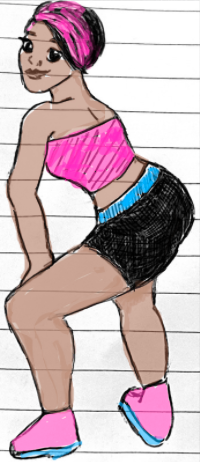
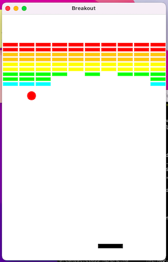
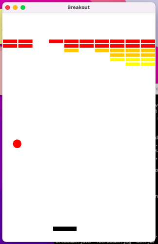
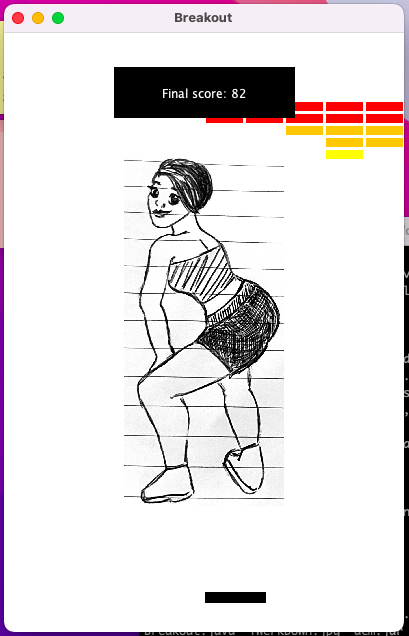

# Brukout
Implementation of classic arcade game [Breakout](https://en.wikipedia.org/wiki/Breakout_%28video_game%29) with a Caribbean twist  
'Brukout' means to get wild while dancing, which is popularised by Caribbean artist Major Lazer and characterised in this game by the 'Brukout Girl'

## How to Play

- A game consists of three turns, in which the player bounces a ball off the paddle and the walls of the Game to break the coloured bricks at the top of the screen
- The player loses a turn if the ball hits the lower wall, which means that the player must have missed it with the paddle. The player loses the game if they lose all three turns
- The player wins if the last brick is eliminated and the game ends immediately
- Regardless of whether the player wins or loses, the 'Brukout Girl' will appear to dance with excitement and the final score of the game

  

## Rules and Game Logic 

- The coloured rectangles in the top part of the screen are bricks, and the black long rectangle at the bottom is the paddle
- The player controls the paddle with the mouse, which is fixed in the vertical or y axis and moves back and forth across in the x axis along the screen
- On each turn, a ball is launched from the centre of the screen towards the bottom at a random angle
- When the ball collides with a brick, the brick 'breaks' and disappears
- The movement of  the ball is controlled by bouncing it off the paddle, walls of the game whilst obeying the laws of physics
- The velocity of the ball increases as the game progresses in each turn

## Software Requirements

Coming soon